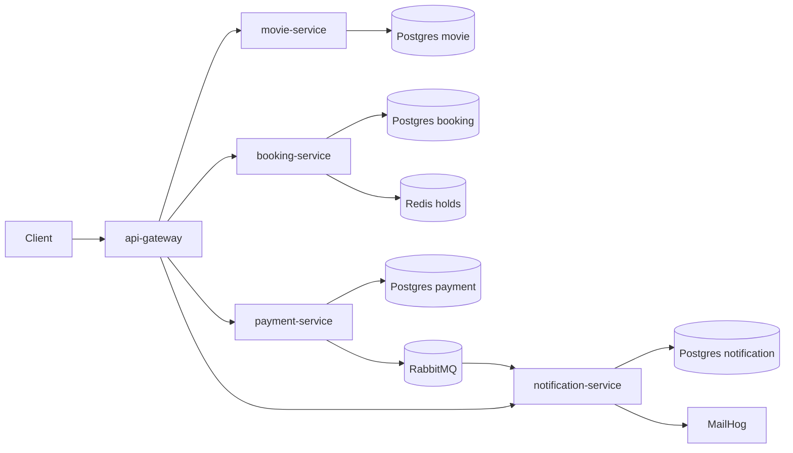

# Ticket Booking System — CKAD Capstone

## Giới thiệu dự án

**Bài toán nghiệp vụ:** hệ thống đặt vé xem phim (cinema ticket booking).
Người dùng xem danh sách phim/suất chiếu, giữ chỗ ghế, thanh toán, và nhận
thông báo xác nhận qua email — mô phỏng đúng luồng nghiệp vụ thật của một
rạp chiếu phim, không phải app "hello world".

**Kiến trúc microservices** — 5 service Go độc lập, mỗi service một
bounded context và một datastore riêng (đúng yêu cầu §3.1/§2.2 của
`capstone-requirements.md`):

| Service | Vai trò | Datastore riêng |
| --- | --- | --- |
| `api-gateway` | Cổng vào duy nhất cho traffic ngoài (NodePort `30080`); xác thực JWT, rate limit | — |
| `movie-service` | Quản lý phim, rạp, suất chiếu | Postgres riêng |
| `booking-service` | Giữ ghế (hold) và tạo booking | Postgres + Redis (TTL cho hold) |
| `payment-service` | Xử lý thanh toán, phát sự kiện thanh toán | Postgres + RabbitMQ (publisher) |
| `notification-service` | Nghe sự kiện thanh toán, gửi email/QR xác nhận | Postgres + RabbitMQ (consumer) + MailHog |

Toàn bộ traffic từ bên ngoài chỉ đi qua `api-gateway`; các service còn lại
chỉ lộ ClusterIP và giao tiếp nội bộ qua Kubernetes DNS — đúng mô hình
đồng bộ (HTTP) kết hợp bất đồng bộ (RabbitMQ) mà đề bài yêu cầu phải tài
liệu hoá (§3.1 "Sync vs async").

**Mục tiêu dự án**: đây là bài capstone CKAD (Certified Kubernetes
Application Developer) — dùng chính hệ thống trên làm đối tượng thực hành,
đóng gói container, triển khai lên Kubernetes, và trình diễn toàn bộ các
domain thi CKAD (multi-container Pod, rolling update, Config/Secret, RBAC,
quota, Service/Ingress/NetworkPolicy, PVC, probe, Helm, Kustomize) thông
qua 20 lab hướng dẫn (chi tiết ở mục
["Mô tả các Lab"](#mô-tả-các-lab) cuối file).

Toàn bộ yêu cầu chi tiết (mục §1–§8) nằm trong
[`capstone-requirements.md`](capstone-requirements.md); README này là bản
hiện thực hoá + hướng dẫn vận hành cho đúng yêu cầu đó.

---

A cinema ticket booking platform built as five independently deployable Go
microservices, used as the hands-on subject for a CKAD (Certified Kubernetes
Application Developer) capstone: containerize it, deploy it to Kubernetes,
and demonstrate the full CKAD exam surface (multi-container Pods, rollouts,
Config/Secrets, RBAC, quotas, Services/Ingress/NetworkPolicy, PVCs, probes,
Helm, Kustomize) against it via 20 guided labs.

See [`capstone-requirements.md`](capstone-requirements.md) for the full
assignment brief this project satisfies.

## Architecture



| Service | Responsibility | Own datastore |
| --- | --- | --- |
| api-gateway | Public entry point (NodePort `30080`); JWT auth and rate limiting | — |
| movie-service | Movies, cinemas and showtimes | Postgres |
| booking-service | Seat holds and bookings | Postgres + Redis (hold TTLs) |
| payment-service | Payment processing; publishes payment events | Postgres + RabbitMQ (publisher) |
| notification-service | Consumes payment events, sends email/QR notifications | Postgres + RabbitMQ (consumer) + MailHog |

All public traffic enters through `api-gateway`; every other service is
ClusterIP-only and reached via Kubernetes DNS. Every service Pod runs the
same three-container pattern: an `init-db-migrate` init container, the `app`
container, and a `log-shipper` sidecar sharing an `emptyDir` log volume (plus
an `nginx-ambassador` sidecar in front of `app`). See
[`docs/architecture.md`](docs/architecture.md) for more detail and
[`docs/ckad-checklist.md`](docs/ckad-checklist.md) for the current
requirement-by-requirement status.

## Repository map

```
movie-booking/            application source, one directory per service
  api-gateway/ movie-service/ booking-service/
  payment-service/ notification-service/
  shared-images/          log-shipper and nginx-ambassador sidecar images
  docker-compose.yml       local dev stack without Kubernetes
  k8s/                     Kubernetes manifests for the real deployment
    <service>/             Deployment + Service + ConfigMap per service
    postgres-*/ redis/ rabbitmq/ mailhog/   backing datastores
    network/               Ingress + NetworkPolicy
    security/              ServiceAccount/Role/RoleBinding
    quota/                 ResourceQuota + LimitRange
    autoscaling/            HPA
    phase5-testing/         standalone smoke-test.sh / e2e-test.sh (run manually)
  k8s-kustomize/           base + dev/prod overlays for movie-service (used by Lab 2.4)
  lab-3.3/ lab-3.4/        RBAC and quota fixtures used by Lab 3.3 / Lab 3.4
helm/movie-service/        Helm chart wrapping movie-service (Lab 5.4)
labs/                      one run.sh + check.sh per CKAD lab (see below)
docs/                      architecture and CKAD requirement checklist
scripts/                   build/deploy/verify/secret helpers (see below)
```

`movie-booking/lab-3.3` and `movie-booking/lab-3.4` live next to the service
source rather than under `labs/` for historical reasons (this repo has not
yet done the Phase 2 path migration mentioned below) — they are not dead
code, `labs/lab-3.3/run.sh` and `labs/lab-3.4/run.sh` apply them directly.

### Mapping to the capstone deliverable layout

`capstone-requirements.md` §6.1 describes an idealised `services/` + `k8s/base`
+ `k8s/overlays/` tree; this repo's actual paths differ but cover the same
ground:

| Capstone doc calls it | Actual path here |
| --- | --- |
| `services/<svc>/Dockerfile` | `movie-booking/<svc>/Dockerfile` |
| `k8s/base`, `k8s/network`, `k8s/security`, `k8s/quota` | `movie-booking/k8s/*` (flat manifests, not a base/overlay split for the whole app) |
| `k8s/overlays/dev`, `k8s/overlays/prod` | `movie-booking/k8s-kustomize/overlays/{dev,prod}` (movie-service only) |
| `helm/<chart>` | `helm/movie-service/` |
| `scripts/build.sh` | `scripts/build.sh` |
| `scripts/deploy.sh` | `scripts/deploy-kubernetes.sh` |
| `scripts/smoke-test.sh` | `scripts/verify-kubernetes.sh` (quick) or `movie-booking/k8s/phase5-testing/{smoke-test.sh,e2e-test.sh}` (thorough) |

## Prerequisites

- Docker Desktop with Kubernetes enabled (this project targets the
  `docker-desktop` context; adjust NodePort/StorageClass assumptions if you
  use a different cluster)
- `kubectl` (Kustomize is built in via `kubectl apply -k`, no separate install)
- `helm` v3, for Lab 5.4
- `openssl`, for `scripts/generate-local-secrets.sh`

## Quickstart: deploy the application

```bash
# 1. Build all five service images + the two sidecar images, tag 1.0.0.
bash scripts/build.sh

# 2. Generate a local secret bundle (random suffix, gitignored) and load it.
bash scripts/generate-local-secrets.sh "Ten Cua Ban" 0311
source .env.local

# 3. Create the runtime Secrets in-cluster, then deploy every manifest.
bash scripts/create-secrets.sh
bash scripts/deploy-kubernetes.sh

# 4. Verify.
bash scripts/verify-kubernetes.sh
curl http://localhost:30080/healthz
```

Prefer to set secrets by hand instead of generating them? Export the four
values yourself before step 3:

```bash
export DB_PASSWORD='...'
export RABBITMQ_USERNAME='...'
export RABBITMQ_PASSWORD='...'
export JWT_SECRET='...'
bash scripts/create-secrets.sh
```

### From Windows PowerShell

`bash` here is usually WSL/Git Bash, so set variables with PowerShell syntax
(not `export`) before calling into it:

```powershell
$env:DB_PASSWORD = 'postgres-password-cua-ban'
$env:JWT_SECRET = 'jwt-secret-dai-va-ngau-nhien'
$env:RABBITMQ_USERNAME = 'appuser'
$env:RABBITMQ_PASSWORD = 'rabbitmq-password-cua-ban'

bash scripts/deploy-kubernetes.sh
bash scripts/verify-kubernetes.sh
```

Run the static capstone audit (checks manifests/scripts exist and contain no
plaintext training credentials — does not touch the cluster) with:

```bash
bash scripts/check-capstone.sh
```

## Running the CKAD labs

`labs/` holds one stable entry point per lab, `labs/lab-<day>.<n>/`:

```bash
# Demo: may create/modify/delete cluster resources.
bash labs/lab-1.1/run.sh

# Read-only evidence check: safe to run repeatedly, never mutates the cluster.
bash labs/lab-1.1/check.sh
```

Some labs (4.1–5.4) also ship a `cleanup.sh` that removes exactly what that
lab created.

**Read [`labs/PREREQUISITES.md`](labs/PREREQUISITES.md) before your first
run** — it covers the `export` variables each lab needs, cross-lab
dependencies (e.g. Lab 2.1 must run before Lab 2.4), and how to clear the
shared `lab` namespace when its 10-Pod quota fills up from earlier labs.

Labs that touch a database need an isolated Secret first, matching the
`DB_PASSWORD` used in the deploy step above:

```bash
export LAB_DB_PASSWORD='...'
bash scripts/create-lab-secrets.sh
```

## Debugging

Standard triage order for a Pod that isn't `Ready`:

```bash
# 1. Which Pod, and what state is it in.
kubectl get pods -n movie-booking -o wide

# 2. Why: check container states and recent events at the bottom.
kubectl describe pod <pod-name> -n movie-booking

# 3. What the app/sidecar actually said. Use -c for the specific container;
#    each Pod here runs app + log-shipper + nginx-ambassador (+ an init
#    container that only appears until it succeeds).
kubectl logs <pod-name> -n movie-booking -c app
kubectl logs <pod-name> -n movie-booking -c app --previous   # after a restart

# 4. Namespace-wide event stream, oldest first — useful for cascading
#    failures (e.g. a crashed dependency blocking another Pod's init container).
kubectl get events -n movie-booking --sort-by=.lastTimestamp

# 5. Is it a resource problem?
kubectl top pods -n movie-booking
kubectl top nodes
```

If a Service has no traffic reaching it, check `kubectl get endpoints -n
movie-booking <service-name>` next — an empty list means either the backing
Pods aren't Ready yet or the Service's `selector` doesn't match the Pods'
labels (see Lab 5.3 for a worked example of the latter).

## Known limitations

- This repo is still on the "Phase 1" reorganisation described in
  [`docs/ckad-checklist.md`](docs/ckad-checklist.md): a few lab fixtures
  (`movie-booking/lab-3.3`, `movie-booking/lab-3.4`) and the standalone
  `movie-booking/k8s/phase5-testing` scripts have not yet been moved under
  `labs/`. They are functional, just not yet relocated.
- See `docs/ckad-checklist.md` for the full requirement-by-requirement gap
  list against the capstone rubric.

## Mô tả các Lab

20 lab trong [`labs/`](labs/), chia theo 5 ngày học tương ứng 5 domain thi
CKAD (bám sát §9 của `capstone-requirements.md`). Mỗi lab chạy độc lập qua
`bash labs/lab-<id>/run.sh` rồi `bash labs/lab-<id>/check.sh` (xem mục
["Running the CKAD labs"](#running-the-ckad-labs) ở trên).

**Ngày 1 — Application Design and Build (20%)**

| Lab | Nội dung |
| --- | --- |
| 1.1 — The 60-Second Pod | Tạo Pod bằng lệnh imperative kèm labels/env/resources; export manifest bằng `--dry-run=client -o yaml`; kiểm tra trạng thái Pod không cần mở editor (tốc độ thi) |
| 1.2 — Init + Sidecar Pattern | Pod nhiều container: init container, app container, sidecar; chia sẻ dữ liệu qua `emptyDir`; xem log qua `kubectl logs -c` |
| 1.3 — Jobs & CronJobs | Chạy Job một lần tới khi hoàn tất với `backoffLimit`; tạo CronJob sinh Job theo lịch; phân biệt Job/CronJob với Deployment |
| 1.4 — Label & Annotation Drill | Tạo hàng loạt Pod và cập nhật label trên nhiều object; truy vấn bằng label selector; dùng `--overwrite` |

**Ngày 2 — Application Deployment (20%)**

| Lab | Nội dung |
| --- | --- |
| 2.1 — Rolling Update & Rollback | Rolling update từ v1 sang v2; theo dõi `rollout status`; rollback sau khi giả lập deploy lỗi |
| 2.2 — Blue/Green Switch | Chạy song song 2 Deployment (blue/green); chuyển traffic bằng cách đổi selector của 1 Service duy nhất |
| 2.3 — Scale & HPA | Scale thủ công Deployment lên 10 replica; cấu hình HPA theo ngưỡng CPU 50% |
| 2.4 — Kustomize Overlay | Tổ chức thư mục `base/` + overlay; patch image tag và số replica mà không lặp lại manifest |

**Ngày 3 — Application Environment, Configuration & Security (25%)**

| Lab | Nội dung |
| --- | --- |
| 3.1 — ConfigMap & Secret Injection | Tạo Secret từ file, ConfigMap từ literal; inject Secret qua env var và ConfigMap qua volume trong cùng 1 Pod |
| 3.2 — Security Context Lockdown | Chạy Pod non-root với root filesystem read-only; drop toàn bộ capabilities; tắt privilege escalation |
| 3.3 — ServiceAccount & RBAC | Tạo ServiceAccount, Role, RoleBinding; Pod dùng token của SA để gọi API list Pod trong namespace |
| 3.4 — Namespace Quotas | Áp ResourceQuota và LimitRange; quan sát Pod bị từ chối khi vượt quota |

**Ngày 4 — Services and Networking (20%)**

| Lab | Nội dung |
| --- | --- |
| 4.1 — ClusterIP & NodePort | Tạo backend ClusterIP và frontend NodePort; chẩn đoán và sửa lỗi selector không khớp; kiểm tra Endpoints |
| 4.2 — Ingress Routing | Route `/` tới frontend, `/api` tới backend qua Ingress; xác minh qua endpoint của ingress controller |
| 4.3 — NetworkPolicy Isolation | Chỉ cho phép traffic frontend → backend; chặn egress của backend ra internet (`0.0.0.0/0`) |
| 4.4 — Persistent Volume Claims | Cấp PVC 1Gi bằng dynamic provisioning; mount vào Pod, ghi dữ liệu, xoá Pod, tạo lại, xác minh dữ liệu còn nguyên |

**Ngày 5 — Application Observability and Maintenance (15%)**

| Lab | Nội dung |
| --- | --- |
| 5.1 — Self-Healing App | Cấu hình liveness probe kiểu HTTP; readiness probe kiểu file; tuỳ chọn startup probe cho container khởi động chậm |
| 5.2 — CLI Observability | Dùng `kubectl logs` với `-c` và `--previous`; đọc Events qua `describe`/`get events`; dùng `kubectl top` xem tài nguyên |
| 5.3 — Broken YAML Triage | Sửa lỗi selector không khớp trong Deployment; sửa lỗi `targetPort` của Service; sửa tên image sai |
| 5.4 — Helm Deploy & Rollback | Cài Helm chart kèm override values; upgrade release rồi rollback về revision trước |

Một số lab (đặc biệt 3.4, 4.1) trông "đơn giản" hơn các lab khác — đây là
chủ đích của đề bài (§9 chỉ yêu cầu vài bullet ngắn gọn mỗi lab, tập trung
đúng 1-2 khái niệm CKAD cụ thể), không phải thiếu sót. Lab nào bị chặn bởi
giới hạn môi trường (thiếu ingress controller cho 4.2, CNI không hỗ trợ
NetworkPolicy cho 4.3 — xem [Known limitations](#known-limitations)) vẫn
chạy đúng logic, chỉ không thể trình diễn hiệu ứng thật trên
Docker Desktop.
