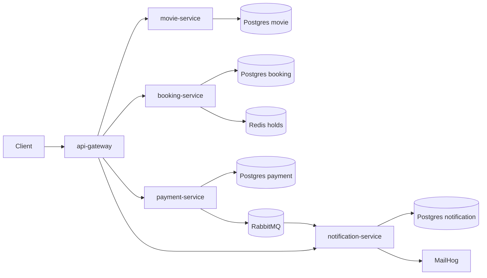

# Ticket Booking System — CKAD Capstone

A cinema ticket booking platform built as five independently deployable Go
microservices, used as the hands-on subject for a CKAD (Certified Kubernetes
Application Developer) capstone: containerize it, deploy it to Kubernetes,
and demonstrate the full CKAD exam surface (multi-container Pods, rollouts,
Config/Secrets, RBAC, quotas, Services/Ingress/NetworkPolicy, PVCs, probes,
Helm, Kustomize) against it via 20 guided labs.

See [`capstone-requirements.md`](capstone-requirements.md) for the full
assignment brief this project satisfies.

## Architecture



| Service | Responsibility | Own datastore |
| --- | --- | --- |
| api-gateway | Public entry point (NodePort `30080`); JWT auth and rate limiting | — |
| movie-service | Movies, cinemas and showtimes | Postgres |
| booking-service | Seat holds and bookings | Postgres + Redis (hold TTLs) |
| payment-service | Payment processing; publishes payment events | Postgres + RabbitMQ (publisher) |
| notification-service | Consumes payment events, sends email/QR notifications | Postgres + RabbitMQ (consumer) + MailHog |

All public traffic enters through `api-gateway`; every other service is
ClusterIP-only and reached via Kubernetes DNS. Every service Pod runs the
same three-container pattern: an `init-db-migrate` init container, the `app`
container, and a `log-shipper` sidecar sharing an `emptyDir` log volume (plus
an `nginx-ambassador` sidecar in front of `app`). See
[`docs/architecture.md`](docs/architecture.md) for more detail and
[`docs/ckad-checklist.md`](docs/ckad-checklist.md) for the current
requirement-by-requirement status.

## Repository map

```
movie-booking/            application source, one directory per service
  api-gateway/ movie-service/ booking-service/
  payment-service/ notification-service/
  shared-images/          log-shipper and nginx-ambassador sidecar images
  docker-compose.yml       local dev stack without Kubernetes
  k8s/                     Kubernetes manifests for the real deployment
    <service>/             Deployment + Service + ConfigMap per service
    postgres-*/ redis/ rabbitmq/ mailhog/   backing datastores
    network/               Ingress + NetworkPolicy
    security/              ServiceAccount/Role/RoleBinding
    quota/                 ResourceQuota + LimitRange
    autoscaling/            HPA
    phase5-testing/         standalone smoke-test.sh / e2e-test.sh (run manually)
  k8s-kustomize/           base + dev/prod overlays for movie-service (used by Lab 2.4)
  lab-3.3/ lab-3.4/        RBAC and quota fixtures used by Lab 3.3 / Lab 3.4
helm/movie-service/        Helm chart wrapping movie-service (Lab 5.4)
labs/                      one run.sh + check.sh per CKAD lab (see below)
Lab/                       lab instructions, one <day>_<n>.md per lab
docs/                      architecture and CKAD requirement checklist
scripts/                   build/deploy/verify/secret helpers (see below)
```

`movie-booking/lab-3.3` and `movie-booking/lab-3.4` live next to the service
source rather than under `labs/` for historical reasons (this repo has not
yet done the Phase 2 path migration mentioned below) — they are not dead
code, `labs/lab-3.3/run.sh` and `labs/lab-3.4/run.sh` apply them directly.

### Mapping to the capstone deliverable layout

`capstone-requirements.md` §6.1 describes an idealised `services/` + `k8s/base`
+ `k8s/overlays/` tree; this repo's actual paths differ but cover the same
ground:

| Capstone doc calls it | Actual path here |
| --- | --- |
| `services/<svc>/Dockerfile` | `movie-booking/<svc>/Dockerfile` |
| `k8s/base`, `k8s/network`, `k8s/security`, `k8s/quota` | `movie-booking/k8s/*` (flat manifests, not a base/overlay split for the whole app) |
| `k8s/overlays/dev`, `k8s/overlays/prod` | `movie-booking/k8s-kustomize/overlays/{dev,prod}` (movie-service only) |
| `helm/<chart>` | `helm/movie-service/` |
| `scripts/build.sh` | `scripts/build.sh` |
| `scripts/deploy.sh` | `scripts/deploy-kubernetes.sh` |
| `scripts/smoke-test.sh` | `scripts/verify-kubernetes.sh` (quick) or `movie-booking/k8s/phase5-testing/{smoke-test.sh,e2e-test.sh}` (thorough) |

## Prerequisites

- Docker Desktop with Kubernetes enabled (this project targets the
  `docker-desktop` context; adjust NodePort/StorageClass assumptions if you
  use a different cluster)
- `kubectl` (Kustomize is built in via `kubectl apply -k`, no separate install)
- `helm` v3, for Lab 5.4
- `openssl`, for `scripts/generate-local-secrets.sh`

## Quickstart: deploy the application

```bash
# 1. Build all five service images + the two sidecar images, tag 1.0.0.
bash scripts/build.sh

# 2. Generate a local secret bundle (random suffix, gitignored) and load it.
bash scripts/generate-local-secrets.sh "Ten Cua Ban" 0311
source .env.local

# 3. Create the runtime Secrets in-cluster, then deploy every manifest.
bash scripts/create-secrets.sh
bash scripts/deploy-kubernetes.sh

# 4. Verify.
bash scripts/verify-kubernetes.sh
curl http://localhost:30080/healthz
```

Prefer to set secrets by hand instead of generating them? Export the four
values yourself before step 3:

```bash
export DB_PASSWORD='...'
export RABBITMQ_USERNAME='...'
export RABBITMQ_PASSWORD='...'
export JWT_SECRET='...'
bash scripts/create-secrets.sh
```

### From Windows PowerShell

`bash` here is usually WSL/Git Bash, so set variables with PowerShell syntax
(not `export`) before calling into it:

```powershell
$env:DB_PASSWORD = 'postgres-password-cua-ban'
$env:JWT_SECRET = 'jwt-secret-dai-va-ngau-nhien'
$env:RABBITMQ_USERNAME = 'appuser'
$env:RABBITMQ_PASSWORD = 'rabbitmq-password-cua-ban'

bash scripts/deploy-kubernetes.sh
bash scripts/verify-kubernetes.sh
```

Run the static capstone audit (checks manifests/scripts exist and contain no
plaintext training credentials — does not touch the cluster) with:

```bash
bash scripts/check-capstone.sh
```

## Running the CKAD labs

`labs/` holds one stable entry point per lab, `labs/lab-<day>.<n>/`:

```bash
# Demo: may create/modify/delete cluster resources.
bash labs/lab-1.1/run.sh

# Read-only evidence check: safe to run repeatedly, never mutates the cluster.
bash labs/lab-1.1/check.sh
```

Some labs (4.1–5.4) also ship a `cleanup.sh` that removes exactly what that
lab created.

**Read [`labs/PREREQUISITES.md`](labs/PREREQUISITES.md) before your first
run** — it covers the `export` variables each lab needs, cross-lab
dependencies (e.g. Lab 2.1 must run before Lab 2.4), and how to clear the
shared `lab` namespace when its 10-Pod quota fills up from earlier labs.

Labs that touch a database need an isolated Secret first, matching the
`DB_PASSWORD` used in the deploy step above:

```bash
export LAB_DB_PASSWORD='...'
bash scripts/create-lab-secrets.sh
```

## Known limitations

- This repo is still on the "Phase 1" reorganisation described in
  [`docs/ckad-checklist.md`](docs/ckad-checklist.md): a few lab fixtures
  (`movie-booking/lab-3.3`, `movie-booking/lab-3.4`) and the standalone
  `movie-booking/k8s/phase5-testing` scripts have not yet been moved under
  `labs/`. They are functional, just not yet relocated.
- `Lab/3_4.md` through `Lab/5_4.md` (10 of the 20 lab instruction files) are
  currently empty; `run.sh`/`check.sh` exist for all of them, but the written
  walkthrough is outstanding and not every one has been re-verified after the
  latest script fixes.
- See `docs/ckad-checklist.md` for the full requirement-by-requirement gap
  list against the capstone rubric.
