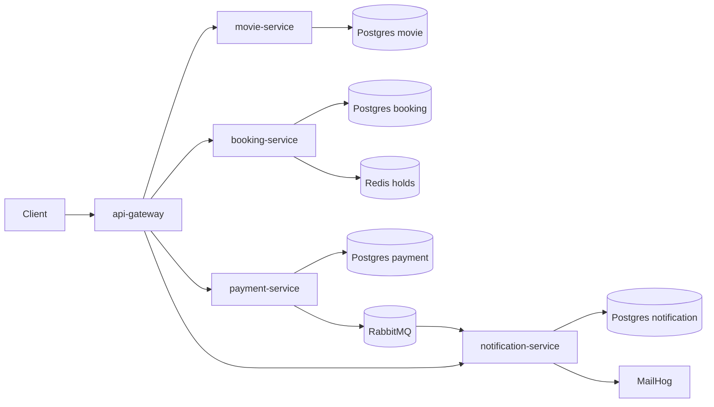

# Architecture

All public traffic enters through `api-gateway`. Booking calls movie service by
Kubernetes service DNS; payment calls booking; payment publishes an event to
RabbitMQ; notification consumes that event. Each stateful business service owns
its Postgres database.

The application deployments currently demonstrate an init container for
migrations, an `emptyDir` shared with a log-shipper sidecar, and an nginx
ambassador sidecar. The production network/security policy will be added in
Phase 2.
